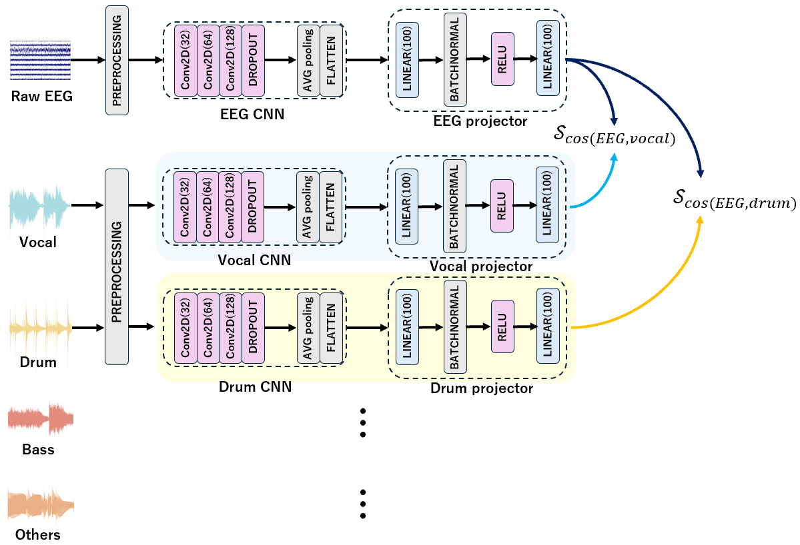

# Decoding Selective Auditory Attention to Musical Elements in Ecologically Valid Music Listening

## Neural Network Architecture
EEG and four audio streams are processed independently using separate 2D CNNs.
Cosine similarity between EEG and each audio embedding is computed (4 times), forming a similarity matrix.
Contrastive loss is calculated from this similarity matrix.
 

## How to run codes
### A. For data separation
1. **Update the data preparation path**
   - Open `codes_attention/attention/preprocessing/transform.py`.
   - Update the `tracklist.csv` path on line 13 to the correct location.

2. **Set the correct mode for preprocessing**
   - Open `codes_attention/attention/sequential.sh`.
   - Add the `--mode preprocess` argument (see `codes_attention/attention/main.py`, lines 72–75).

3. **Run the experiment**
   - Execute the script from the `codes_attention/attention/` directory:
     ```bash
     nohup sh sequential.sh > log/log.txt &
     ```
   
### B. Steps to Execute Experiments
1. **Update dataset path and path parsing**
   - Open `codes_attention/attention/datasets/preprocessing_eegmusic_dataset.py`.
   - Update the dataset root path on line 40.
   - Update the index mapping for each path component (lines 266–282).

   Example path:
   `codes_attention/dataset/eeg/0/train/3/0/5/eeg.pkl`
   This corresponds to:
   - `subject_id`: `part[4]`
   - `subset`: `part[5]`
   - `song_id`: `part[6]`
   - `task`: `part[7]`
   - `attention_score`: `part[8]`

2. **Choose the loss (`--key`)**
   - Open `codes_attention/attention/sequential.sh`.
   - Set `--key` to one of:
     - `all`: use all trials for training/validation
     - `high_attention`: use only trials with `attention_score` 4 or 5 for training/validation  
       (see `codes_attention/attention/contrastive_learning.py`, lines 79–90 and 120–130)

3. **Run experiment**
   - From `codes_attention/attention/`, execute:
     ```bash
     nohup sh sequential.sh > log/log.txt &
     ```
   - Logs will be written to `codes_attention/attention/log/log.txt`.

4. **Monitor progress**
   - Check the log output: The log file contains real-time outputs.
   - Trained checkpoints are saved under `codes_attention/attention/runs/`.
   - To customize the run/checkpoint naming, modify `training_date` in `sequential.sh`.

5. **Verify results**
   - You can load a checkpoint in `codes_attention/attention/checkpoint_test.py` (see lines 210 and 214).
   - From `codes_attention/attention/`, execute:
     ```bash
     nohup sh sequential_test.sh > log/log.txt &
   - `codes_attention/attention/checkpoint_example.ckpt` is provided as an example.
     

### Important Notes
- Ensure that the dataset is preprocessed **before** running experiments.
- Verify that the checkpoint paths are correctly specified in the evaluation scripts. Incorrect paths will lead to runtime errors.
- The provided Sequential scripts (**`main.py`**, **`sequential.sh`**, and **`sequential_test.sh`**) are pre-configured with default parameters.  
  Users may adjust these parameters according to their specific experimental requirements.

## Code Structure and Files
### Code Structure for 3-Second Training and Evaluation
```
codes_attention/
├── attention/
│ ├── datasets/ 
│ │ ├── init.py                                                             # Initialization file for the datasets module
│ │ ├── dataset.py                                                          # Base class for datasets
│ │ └── preprocessing_eegmusic_dataset.py                                   # Preprocessing script for EEG and music data
│ │
│ ├── models/ 
│ │ ├── init.py                                                             # Initialization file for the models module
│ │ ├── model.py                                                            # Base class for model definitions              
│ │ └── sample_cnn2d_eeg.py                                                 # Implementation of a 2D CNN model               
│ │
│ ├── modules/ 
│ │ ├── init.py                                                             # Initialization file for the modules 
│ │ ├── clip_loss.py                                                        # Implementation of the Clip Loss function
│ │ └── contrastive_learning.py                                             # Script for contrastive learning
│ │
│ ├── preprocessing/                                                        # Data separation scripts
│ │ ├── init.py
│ │ └── transform.py 
│ │
│ ├── utils/                                                                # Utility functions
│ │ ├── init.py
│ │ ├── checkpoint.py 
│ │ ├── file_helpers.py 
│ │ ├── logger.py 
│ │ ├── time_helper.py 
│ │ └── yaml_config_hook.py 
│ │
│ │
│ ├── main.py                                                               # Main script for training and validation
│ ├── checkpoint_test.py                                                    # Script for loading checkpoints and testing
│ ├── sequential.sh                                                         # Shell script for running training and validation experiments
│ ├── sequential_test.sh                                                    # Shell script for running test experiments
│ ├── checkpoint_example.ckpt                                               # Example checkpoint
│
├── config/                                                                 # Global configuration files
│ └── config.yaml 
│
├── tracklist.csv                                                           # Track list of the dataset used for data preprocessing
├── requirements.txt                                                        # Python dependencies
└── LICENSE                                                                 # License information
```


## License
This project is under the CC-BY-SA 4.0 license. See [LICENSE](LICENSE) for details.

## Copyright
Copyright (c) 2025 Sony Computer Science Laboratories, Inc., Tokyo, Japan. All rights reserved. This source code is licensed under the [LICENSE](LICENSE).
